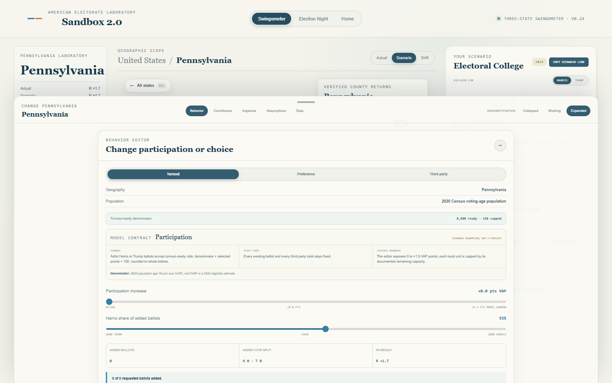

# Sandbox 2.0

An interactive 3D laboratory for building United States presidential-election counterfactuals and watching those scenarios unfold through detailed local returns.



Sandbox 2.0 combines two connected experiences on one persistent deck.gl map:

- **Swingometer:** change turnout, two-party preference, and third-party behavior, then inspect exactly which counties and reporting units moved the result.
- **Election Night:** replay the resulting scenario through deterministic local return events whose timing and geographic order can be directed by the user.

The product is local-first, deterministic, and designed to explain why an election changes rather than only display a new winner.

## Current release

### v0.24: Explicit Swingometer model semantics

Every Turnout, Preference, and Third Party control now carries a visible model contract explaining its population basis, exact operation, preserved quantities, and feasible limits. Directional controls display their calculated endpoints, while requested and realized ballot effects remain separate.

Pennsylvania, Michigan, and Wisconsin retain distinct demographic evidence language. The interface does not flatten Census VTDs, bridged Michigan precinct demographics, and LTSB Wisconsin ward estimates into one generic claim.

[Read the v0.24 release notes](docs/releases/v0.24-swingometer-semantics.md), the [complete model contract](docs/methodology/SWINGOMETER_MODEL_CONTRACT.md), or the [v0.24 verification record](docs/review/v0.24-swingometer-semantics/VERIFICATION.md).

Before expanding the analytics, the project completed an [audit of the old Sandbox](docs/research/OLD_SANDBOX_ANALYTICS_AUDIT.md) and adopted an [Analytics Constitution](docs/methodology/ANALYTICS_CONSTITUTION.md). The resulting [v0.25 plan](docs/plans/v0.25-analytics-foundation.md) restores descriptive depth without importing unsupported probability or decision claims.

The integrated v0.23B Election Night remains directly inside `/app/`. It shares the Swingometer's scenario, mounted 3D map, camera, and geographic selection instead of opening a separate replay product.

The visible count currently includes only the three states with admitted detailed foundations:

| State | Result unit | Map terrain | Election Night status |
| --- | --- | --- | --- |
| Pennsylvania | 2024 reporting units | 2020 Census VTD-linked terrain | Detailed |
| Michigan | 2024 precinct reporting units | Exact-cycle precinct terrain | Detailed |
| Wisconsin | LTSB reconstructed 2024 values | January 2025 ward terrain | Detailed |

The other 48 jurisdictions stay inert during Election Night. The application does not invent statewide or county fallback returns where detailed local data are unavailable.

v0.23B reuses decoded state foundations while Election Night remains open, makes chronology restarts substantially cheaper, and adds a current-only local return tape that explains exactly how each published precinct, VTD, or ward moved its state margin. Its [release notes](docs/releases/v0.23b-election-night-refinement.md) and [verification record](docs/review/v0.23b-election-night-refinement/VERIFICATION.md) remain available.

## What you can do

### Build an election scenario

- Adjust turnout using available local voting-age-population capacity.
- Transfer existing ballots between Harris and Trump without an arbitrary slider ceiling.
- Exchange Stein, Oliver, or residual Other/write-in ballots with a user-selected major-party split.
- Read the exact calculation, invariant, and feasible boundary beside every control.
- Keep separate Pennsylvania, Michigan, and Wisconsin recipes active at the same time.
- Compare certified, modeled, and shifted results at state, county, and reporting-unit level.
- Rank the counties and local units responsible for the change in margin.
- Inspect candidate ledgers, turnout capacity, coverage, crosswalk quality, and operation-level contributions.
- Share deterministic scenario portfolios through versioned URLs.

### Direct Election Night

- Play, pause, reset, seek, or advance one return at a time.
- Choose 0.1x, 0.5x, 1x, 4x, or 12x playback.
- Change the count duration, geographic reporting order, timing volatility, stalls, and state delays.
- Start from Balanced, Rural opening, Metropolitan opening, or Volatile waves profiles.
- Add county-specific activation and count-length overrides.
- Preview state reporting windows before restarting the count.
- Save and reuse custom chronology profiles in browser-local storage.
- Follow a compact local return tape that names the county, ballots, timestamp, and exact two-party margin movement.
- See published-unit progress and the newest reporting state without leaving the map.

Chronology controls change when votes arrive, never how many votes exist. Schedules are deterministic for the same scenario, profile, and seed. State color represents the current reported-vote leader, not a projection or race call.

### Understand the national consequence

- Aggregate detailed state scenarios into national popular-vote and Electoral College totals.
- Explain which modeled states changed the Electoral College outcome.
- Distinguish changed-but-not-flipped states from actual EV transfers.
- Handle exactly 270, above 270, below 270, and 269 to 269 as separate outcomes.
- Calculate deterministic Path to 270 combinations using multiple ranking metrics.
- Move route states from Required to Modeled to Satisfied as detailed scenarios cross their thresholds.

## Design principles

1. **One map, continuous context.** Swingometer and Election Night reuse the same 3D geographic stage.
2. **Detailed data or no return.** Unsupported jurisdictions do not receive fabricated local reporting behavior.
3. **Votes and chronology stay separate.** Scenario recipes determine endpoints; candidate-blind scheduling determines arrival order.
4. **Exact conservation.** Candidate totals reconcile at unit, county, state, and composed-stream levels.
5. **Visible evidence boundaries.** Off-map votes, residual buckets, unmatched geography, and unavailable denominators remain explicit.
6. **Deterministic sharing.** Results are rebuilt from versioned inputs rather than stored as competing derived truth.

## Architecture

```text
Official and documented source artifacts
                    |
       detailed-state import pipelines
                    |
       validated runtime foundations
                    |
   deterministic scenario recipes and workers
          |                         |
    Swingometer endpoint     candidate-blind scheduler
          |                         |
          +------ integrated replay stream ------+
                                                   |
                         React + deck.gl laboratory
```

Important implementation areas:

```text
src/App.tsx                         Product shell and scenario orchestration
src/map/AtlasMapScene.tsx           Persistent national and detailed 3D renderer
src/replay/threeStateElectionNight.ts
                                    PA/MI/WI visible replay scheduling
src/runtime/threeStateNight.worker.ts
                                    Dedicated Election Night worker
src/runtime/useReplayExperience.ts  Playback and React integration
src/data/detailedStateManifest.ts   Typed state and artifact registration
src/data/scenarioPortfolio.ts       Multi-state recipe and summary contracts
src/data/electoralConsequences.ts   Electoral College consequence ledger
src/data/pathTo270.ts               Deterministic route calculation
packages/election-model/            Counterfactual allocation engine
packages/election-replay/           Headless replay contracts and reducers
public/data/{pa,mi,wi}/              Detailed runtime artifacts
scripts/                             Reproducible data pipelines and benchmarks
tests/                               Model, replay, and browser verification
docs/                                Decisions, methodology, reviews, and releases
```

The detailed foundations are decoded and modeled in Web Workers. Scenario requests use monotonically increasing identifiers, queued slider changes are coalesced, stale responses are rejected, and inactive state summaries remain compact. County geometry is loaded lazily and kept in a bounded cache. During Election Night, chronology restarts reuse one active worker with three bounded scenario entries; leaving the mode releases that cache.

## Run locally

Requirements:

- Node.js 22.12 or newer
- npm

```bash
npm install
npm run test:browser:install
npm run dev
```

Vite prints the local development URL when the server starts.

Build a production bundle:

```bash
npm run build
npm run preview
```

Build with the GitHub Pages repository base path:

```bash
npm run build:pages
```

## Verification

The v0.24 release passed:

- 164 of 164 model and replay tests
- 3 of 3 model-semantics contract tests
- 1 of 1 focused model-semantics browser journeys
- 6 of 6 focused three-state scheduler tests
- 2 of 2 focused Election Night browser journeys
- TypeScript production build
- ESLint
- staged-file integrity checks

Run the principal gates locally:

```bash
npm test
npm run test:browser
npm run lint
npm run build
```

Additional deterministic replay benchmarks are available through the `benchmark:*` scripts in `package.json`. GitHub Actions runs the hosted model, build, lint, and browser gates from `.github/workflows/verify.yml`.

## Data and methodology

The model preserves five candidate buckets throughout the replay:

```text
Harris
Trump
Stein
Oliver
Other / write-in residual
```

Pennsylvania retains certified residual and unmatched reporting-unit votes in explicit non-terrain buckets. Michigan preserves central-count, adjustment, and unmatched geographic votes as off-map units. Wisconsin local values are the Wisconsin Legislative Technology Services Bureau's population-disaggregated reconstruction onto 2025 wards, not raw certified ward returns.

Turnout controls use 2020 Census-derived voting-age population where the denominator is valid. That is not citizen voting-age population, a 2024 eligible-voter estimate, or evidence of individual voter preference. Counterfactual controls are transparent assumptions, not forecasts.

Primary sources include:

- [Federal Election Commission, official 2024 presidential results](https://www.fec.gov/resources/cms-content/documents/2024presgeresults.pdf)
- [Pennsylvania Department of State, election data](https://www.pa.gov/agencies/dos/resources/voting-and-elections-resources/voting-and-election-statistics/election-data)
- [Michigan Department of State, election results and data](https://www.michigan.gov/sos/elections/election-results-and-data)
- [Wisconsin LTSB, 2024 election data with 2025 wards](https://www.arcgis.com/home/item.html?id=878d8826218f42509e07437a82ef6b6e)
- [U.S. Census Bureau, 2020 Redistricting Data](https://www.census.gov/programs-surveys/decennial-census/about/rdo/summary-files.html)

See [Detailed State Admission](docs/data/DETAILED_STATE_ADMISSION.md), [State Exceptions](docs/data/STATE_EXCEPTIONS.md), and the [Redistribution Inventory](docs/data/REDISTRIBUTION_INVENTORY.md) for the full evidence and delivery boundaries.

## Release boundary

This repository is an active research and demonstration build. It is not yet cleared as a commercial or broad public data product. Pennsylvania and Michigan redistribution terms remain under review, and deferred human testing is still required before paid delivery.

The current release deliberately excludes:

- Decision Desk projections and calls
- estimated outstanding vote
- hidden-outcome or presenter mode
- accounts, memberships, rooms, or backend persistence
- server-rendered video and export
- unsupported-state local return simulations

A separate national-only sanitized preview is available at [Sandbox 2.0 public demo](https://kevyisagenius123.github.io/election-sandbox-demo/). It excludes detailed state, county, precinct, VTD, demographic, crosswalk, and local scenario artifacts.

## Key documents

- [Product and Engineering Plan](PRODUCT_AND_ENGINEERING_PLAN.md)
- [Run My Election Engine Plan](RUN_MY_ELECTION_ENGINE_PLAN.md)
- [Codex Handoff](CODEX_HANDOFF.md)
- [v0.23 Release Notes](docs/releases/v0.23-election-night.md)
- [v0.23 Verification](docs/review/v0.23a-visible-replay/VERIFICATION.md)
- [Election Night Engine Boundary](docs/decisions/0028-election-night-engine-boundary.md)
- [First Visible Replay Slice](docs/decisions/0039-first-visible-replay-slice.md)
- [Runtime Budgets](docs/operations/RUNTIME_BUDGETS.md)
- [Human Alpha Protocol](docs/research/HUMAN_ALPHA_PROTOCOL.md)

## Status

v0.23 is implemented and verified as a supervisor-review candidate. The next bounded release should be selected from the v0.23 review rather than adding projections, unsupported states, or public restricted-data delivery implicitly.
